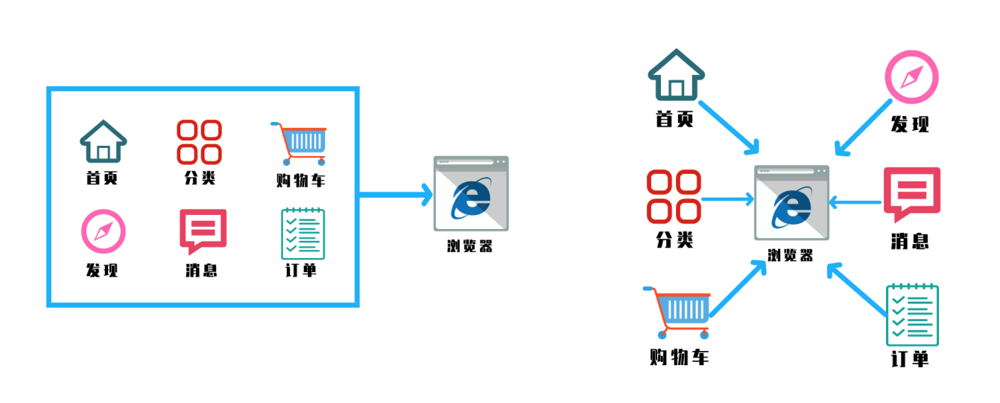
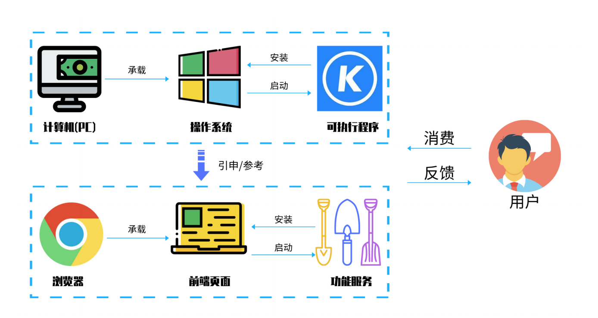

## 一、为什么要学习微前端

### 什么是微前端



微前端就是将不同的功能按照不同的维度拆分成多个子应用。通过主应用来加载这些子应用。

微前端的核心在于拆, 拆完后在合!

### 为什么去使用微前端

- 不同团队间开发同一个应用技术栈不同怎么破？
- 希望每个团队都可以独立开发，独立部署怎么破？
- 项目中还需要老的应用代码怎么破？

我们是不是可以将一个应用划分成若干个子应用，将子应用打包成一个个的lib。当路径切换时加载同的子应用。这样每个子应用都是独立的，技术栈也不用做限制了！从而解决了前端协同开发问题

### 怎样落地微前端



微前端的灵感来源于，计算机上的应用，每一次用户打开一个应用，就相当于打开了一个新的页面

- 2018年 Single-SPA诞生了， single-spa 是一个用于前端微服务化的 JavaScript 前端解决方案 (本身没有处理样式隔离， js 执行隔离) 实现了路由劫持和应用加载
- 2019年 qiankun 基于Single-SPA, 提供了更加开箱即用的 API （ single-spa + sandbox + import-html-entry ） 做到了，技术栈无关、并且接入简单（像iframe 一样简单）

> 总结：子应用可以独立构建，运行时动态加载,主子应用完全解耦，技术栈无关，靠的是协议接入（子应用必须导出 bootstrap、mount、unmount方法）

**这里先回答下大家的问题：**

- 这不是iframe吗？

  如果使用 iframe ， iframe 中的子应用切换路由时用户刷新页面就尴尬了

  更多参考 [Why Not Iframe](https://www.yuque.com/kuitos/gky7yw/gesexv)

- 应用之间怎么通信

  + 基于URL来进行数据传递，但是传递消息能力弱
  + 基于 CustomEvent 实现通信
  + 基于props主子应用间通信
  + 使用全局变量、 Redux 进行通信

- 公共依赖

  + CDN - externals
  + webpack 联邦模块

### 微前端架构具备以下几个核心价值：

- 技术栈无关

  主框架不限制接入应用的技术栈，微应用具备完全自主权

- 独立开发、独立部署

  微应用仓库独立，前后端可独立开发，部署完成后主框架自动完成同步更新

- 增量升级

  在面对各种复杂场景时，我们通常很难对一个已经存在的系统做全量的技术栈升级或重构，而微前端是一种非常好的实施渐进式重构的手段和策略

- 独立运行时

  每个微应用之间状态隔离，运行时状态不共享

## 二、SingleSpa 实战

[single-spa官网](https://zh-hans.single-spa.js.org/docs/getting-started-overview)

### 构建子应用

我们需要父应用加载子应用，需要暴露三个方法
  1. bootstrap
  2. mount
  3. unmount

1. 构建子应用

```
vue create single-child
npm i --save single-spa-vue
```

```js
import singleSpaVue from 'single-spa-vue'

const appOptions = {
  el: '#vue', // 挂载到父应用中的 id 为 vue 的标签中
  router,
  render: h => h(App)
}

const vueLifeCycle = singleSpaVue({ // 返回single-spa 的生命周期也就是 bootstrap/mount/unmount
  Vue,
  appOptions
});

// single规定的协议，父应用会调用这些方法
export const bootstrap = vueLifeCycle.bootstrap;
export const mount = vueLifeCycle.mount;
export const unmount = vueLifeCycle.unmount;
// 这样做还有一个严重的问题，子应用无法启动了？？
```

2. 配置子应用中的打包路径

```js
module.exports = {
  configureWebpack: {
    output: {
      library: 'singleVue',
      libraryTarg: 'umd'
    },
    devServer: {
      port: 10000
    }
  }
};
```

3. 配置子应用的路由

```js
const router = new VueRouter({
  mode: 'history',
  base: '/vue',
  routes
})
```

4. 父应用搭建

```
vue create single-parent
npm i --save single-spa
```

5. 将子应用挂载到 `id="vue"` 的容器中

```html
<div id="app">
  <!-- 当路由切换到 /vue 时加载子应用 -->
  <router-link to="/vue">加载vue引用</router-link>
  <router-view/>
  <!-- 子应用加载的位置 -->
  <div id="vue"></div>
</div>
```

6. 配置父应用加载子应用

```js
import { registerApplication, start } from 'single-spa'

async function loadScript(url) { // 异步加载子组件中的脚本
  return new Promise((resolve, reject) => {
    let script = document.createElement('script');
    script.src = url;
    script.onload = resolve;
    script.onerror = reject;
    document.head.appendChild(script);
  });
}

registerApplication(
  'myVueApp',
  async () => {
    console.log('加载模块');
    // 加载子应用中的脚本
    await loadScript(`http://localhost:10000/js/chunk-vendors.js`)
    await loadScript(`http://localhost:10000/js/app.js`)
    // 这里需要要返回 bootstrap/mount/unmount
    return window.singleVue
  },
  location => location.pathname.startsWith('/vue'), // 此路径用来判断当前路由切换到 /vue 的路径下，需要加载我们定义的子应用
  { a: 1 } // 选传，传给子应用 props 的参数，可以是对象或值
);

start(); // 启动应用
```

7. 配置子应用的路径

```js
// 设置路径
if (window.singleSpaNavigate) { // 如果是父应用去应用，那会自动挂载一个属性为true
  __webpack_public_path__ = 'http://localhost:10000/'
}
```

8. 希望子应用可以独立运行，在子应用中添加一个配置

```js
if(!window.singleSpaNavigate){
  delete appOptions.el; // 子应用中没有#vue，所以需要手动删除，挂载到 #app 中
  new Vue(appOptions).$mount('#app');
}
```

### singleSpa 缺陷

1. 不能动态加载JS文件
2. 样式不隔离
3. 全局对象，没有JS沙箱的机制

## 三、qiankun 实战

[qiankun官网](https://qiankun.umijs.org/zh/guide)

### 特点

  1. 简单：任意 js 框架均可使用。微应用接入像使用接入一个 iframe 系统一样简单，但实际不是 iframe。
  2. 完备：几乎包含所有构建微前端系统时所需要的基本能力，如 样式隔离、js 沙箱、预加载等。
  3. 生产可用：已在蚂蚁内外经受过足够大量的线上系统的考验及打磨，健壮性值得信赖。

### 项目构建

1. 主应用搭建 `qiankun-base`

```
vue create qiankun-base
npm i --save qiankun
```

```js
// 配置主项目的加载 main.js
import Vue from 'vue'
import App from './App.vue'
import router from './router'
import ElementUI from 'element-ui';
import 'element-ui/lib/theme-chalk/index.css';

import {registerMicroApps, start} from 'qiankun';

Vue.config.productionTip = false
Vue.use(ElementUI);

const apps = [
  {
    name: 'vueApp', // 应用的名字
    entry: 'http://localhost:10000/', // 默认加载这个html，解析里面的js动态的执行（子应用必须支持跨域，内部使用的是 fetch）
    container: '#vue', // 要渲染到的容器名id
    activeRule: '/vue' // 通过哪一个路由来激活
  },
  {
    name: 'reactApp',
    entry: 'http://localhost:20000/',
    container: '#react',
    activeRule: '/react'
  }
];

registerMicroApps(apps); // 注册应用
start(); // 开启应用

new Vue({
  router,
  render: h => h(App)
}).$mount('#app')
```

```html
<!-- 设置容器 -->
<template>
  <div>
    <el-menu :router="true" mode="horizontal">
      <!-- 主应用中也可以放自己的路由 -->
      <el-menu-item index="/">首页</el-menu-item>
      <!-- 引用其他的子应用 -->
      <el-menu-item index="/vue">vue应用</el-menu-item>
      <el-menu-item index="/react">react应用</el-menu-item>
    </el-menu>
    <router-view v-show="$route.name"></router-view>
    <div id="vue"></div>
    <div id="react"></div>
  </div>
</template>
```
2. 搭建Vue子项目

```
vue create qiankun-vue
// 子项目中不需要安装任何依赖，父组件会给window设置一些环境变量
```

```js
// mian.js
import Vue from 'vue'
import App from './App.vue'
import router from './router'

Vue.config.productionTip = false

/*
new Vue({
  router,
  render: h => h(App)
}).$mount('#app')
*/
let instance = null;
function render(props) {
  // props 组件通信
  instance = new Vue({
    router,
    render: h => h(App)
  }).$mount('#app') // 这里是挂载到自己的HTML中，基座会拿到这个挂载后的HTML，将其插入进去
}

if (!window.__POWERED_BY_QIANKUN__) { // 如果是独立运行，则手动调用渲染
  render();
}
if(window.__POWERED_BY_QIANKUN__){ // 如果是qiankun使用到了，则会动态注入路径
  __webpack_public_path__ = window.__INJECTED_PUBLIC_PATH_BY_QIANKUN__;
}

// 根据 qiankun 的协议需要导出 bootstrap/mount/unmount
export async function bootstrap(props) {

};
export async function mount(props) {
  render(props);
};
export async function unmount(props) {
  instance.$destroy();
};
```

```js
// 设置router路径
const router = new VueRouter({
  mode: 'history',
  base: '/vue',
  routes
})
```

```js
// 配置打包 vue.config.js
module.exports = {
  devServer: {
    port: 10000,
    headers:{
      'Access-Control-Allow-Origin': '*' // 允许跨域
    }
  },
  configureWebpack: {
    output: {
      library: 'vueApp',
      libraryTarget: 'umd'
    }
  }
};
```

3. 搭建React项目

```
npx create-react-app qiankun-react
npm i --save-dev react-app-rewired
```

```js
// 入口配置 /src/index.js
import React from 'react';
import ReactDOM from 'react-dom';
import './index.css';
import App from './App';

function render(){
  ReactDOM.render(
    <React.StrictMode>
      <App />
    </React.StrictMode>,
    document.getElementById('root')
  );
}
if(!window.__POWERED_BY_QIANKUN__){
  render();
}
export async function bootstrap(){

}
export async function mount() {
  render()
}
export async function unmount(){
  ReactDOM.unmountComponentAtNode( document.getElementById('root'));
}
```

```js
// 配置启动 config-overrides.js
module.exports = {
  webpack:(config)=>{
    config.output.library = 'reactApp';
    config.output.libraryTarget = 'umd';
    config.output.publicPath = 'http://localhost:20000/';
    return config;
  },
  devServer:(configFunction)=>{
    return function (proxy,allowedHost){
      const config = configFunction(proxy,allowedHost);
      config.headers = {
        "Access-Control-Allow-Origin":'*'
      }
      return config
    }
  }
}
```
```
添加react环境变量 .env

PORT=20000
WDS_SOCKET_PORT=20000
```

```js
// 配置react路由
import { BrowserRouter, Route, Link } from "react-router-dom"
const BASE_NAME = window.__POWERED_BY_QIANKUN__ ? "/react" : "";
function App() {
  return (
    <BrowserRouter basename={BASE_NAME}>
    <Link to="/">首页</Link>
    <Link to="/about">关于</Link>
    <Route path="/" exact render={() => <h1>hello home</h1>}></Route>
    <Route path="/about" render={() => <h1>hello about</h1>}></Route>
    </BrowserRouter>
  );
}
```
