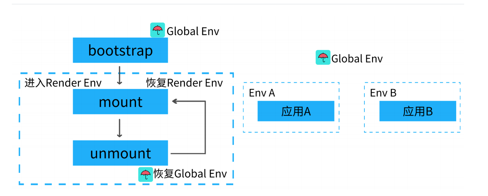

## 一、CSS隔离方案

### 子应用之间的样式隔离

- Dynamic Stylesheet 动态样式表，当应用切换时移除老应用样式，添加新应用样式

### 主应用和子应用之间的样式隔离

- BEM (Block Element Modifier) 约定项目前缀
- CSS-Modules 打包时生成不冲突的选择器名(主流)
- Shadow DOM 真正意义上的隔离
- css-in-js

qiankun 默认是开启了 Shadow DOM 来进行CSS隔离的


[demo](./shadow.html)

## 二、JS的隔离

问题：如果应用A在加载的时候，上面有一个 window.a， 应用B 在加载的时候上面也有一个 window.a ，就会发生冲突



JS的隔离一般采用的是沙箱机制，也就是创建一个干净的环境给子应用使用，当切换时可以寄选择丢弃属性和恢复属性，当运行子应用时应该跑在内部沙箱环境中

JS沙箱的隔离方案：

  1. 快照沙箱，在应用沙箱挂载或卸载时记录快照，在切换时依据快照恢复环境 (无法支持多实例)
  2. Proxy 代理沙箱,不影响全局环境

### 1. 快照沙箱

1. 激活时将当前window属性进行快照处理
2. 失活时用快照中的内容和当前window属性比对
3. 如果属性发生变化保存到 modifyPropsMap 中，并用快照还原window属性
4. 在次激活时，再次进行快照，并用上次修改的结果还原window

```js
class SnapshotSandbox {
  constructor() {
    this.proxy = window; // window属性
    this.modifyPropsMap = {}; // 保存修改了那些属性
    this.active();
  }
  active() { // 激活沙箱
    this.windowSnapshot = {}; // window对象的快照
    for (const prop in window) {
      if (window.hasOwnProperty(prop)) {
        // 将window上的属性进行拍照
        this.windowSnapshot[prop] = window[prop];
      }
    }
    Object.keys(this.modifyPropsMap).forEach(p => {
      window[p] = this.modifyPropsMap[p];
    });
  }
  inactive() { // 丢弃沙箱
    for (const prop in window) { // diff 差异
      if (window.hasOwnProperty(prop)) {
        // 将上次拍照的结果和本次window属性做对比
        if (window[prop] !== this.windowSnapshot[prop]) {
          // 保存修改后的结果
          this.modifyPropsMap[prop] = window[prop];
          // 还原window
          window[prop] = this.windowSnapshot[prop];
        }
      }
    }
  }
}
```

```js
// 快照沙箱
let sandbox = new SnapshotSandbox();
  ((window) => {
  window.a = 1;
  window.b = 2;
  window.c = 3
  console.log(a,b,c)
  sandbox.inactive();
  console.log(a,b,c)
})(sandbox.proxy);
```

### 2. proxy代理沙箱

每个应用都创建一个proxy来代理window，好处是每个应用都是相对独立，不需要直接更改全局window属性！

```js
class ProxySandbox {
  constructor() {
    const rawWindow = window;
    const fakeWindow = {}
    const proxy = new Proxy(fakeWindow, {
      set(target, p, value) {
        target[p] = value;
        return true
      },
      get(target, p) {
        return target[p] || rawWindow[p];
      }
    });
    this.proxy = proxy
  }
}
let sandbox1 = new ProxySandbox();
let sandbox2 = new ProxySandbox();
window.a = 1;

((window) => {
  window.a = 'hello';
  console.log(window.a)
})(sandbox1.proxy);

((window) => {
  window.a = 'world';
  console.log(window.a)
})(sandbox2.proxy);
```

[测试demo](./sandBox.html)
